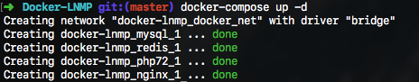
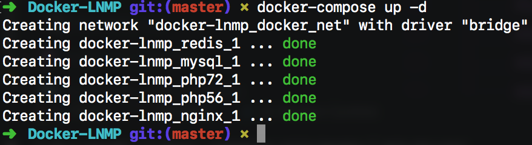

# Docker 快速搭建 Lnmp 开发环境 

只要你敢尝试一次，就再也不会拒绝它

## 如何使用？

#### 1. 安装工具

- Git
- Docker [https://docs.docker.com/install/]
- Docker-compose [https://docs.docker.com/compose/install/#install-compose]

#### 2. 下载代码

```
$ git clone https://github.com/helingfeng/Docker-LNMP.git
```
    
#### 4. 启动服务

```
$ cd Docker-LNMP
$ docker-compose up -d
```

第一次启用服务，需要下载并编译各种工具，请耐心等待一段时间



表示成功启动服务

#### 5. 访问 Demo

打开浏览器访问:
- http://127.0.0.1/
- https://127.0.0.1/


## 问题与解答 ？

#### 1. `workspace`工作目录映射

```markdown
volumes:
      - ./www/:/var/www/html/:rw
```

将 `./www/` 修改为你的 `workspace` 工作目录，注意 `nginx` `php-fpm` 两个应用都需要修改

#### 2. 多个项目系统，采用虚拟域名，如何相互之间访问

`php-fpm` 应用添加 `extra_hosts` 指向 `nginx` 应用

```markdown
extra_hosts:
      - www.demo1.com:172.100.0.2
```
这里的 `172.100.0.2` 表示 `nginx` 应用`ip`

#### 3. 如何切换`php`版本

`nginx` 配置文件 `.conf` 选项 `fastcgi_pass` 参数定义

```markdown
fastcgi_pass   fpm56:9000;
或者
fastcgi_pass   fpm72:9000;

```

#### 4. `PhpStorm` 安装 `xdebug` 调试

##### 添加扩展

以 `php72` 应用为例，首先需要修改 `Dockerfile` 文件，安装 `xdebug` 扩展；

`PECL extensions` 安装说明可以在官网找到：
https://hub.docker.com/_/php/

```markdown
RUN pecl install xdebug-2.6.0 \
    && docker-php-ext-enable xdebug
```
重新构建 `php72` 镜像（删除镜像，启动`docker-compose`）

##### 配置 `xdebug`

修改 `php72.ini` 文件追加
```markdown
xdebug.auto_trace = on
xdebug.default_enable = on
xdebug.auto_profile = on
xdebug.collect_params = on
xdebug.collect_return = on
xdebug.profiler_enable = on
xdebug.remote_enable = on
xdebug.remote_port = 9005
xdebug.remote_handler = dbgp
xdebug.remote_autostart = on
xdebug.remote_connect_back = on
; 配置这个可以查看调试日志
xdebug.remote_log = /var/log/php-fpm/xdebug_remote.log
;xdebug.trace_output_dir = "/var/log/php-fpm/xdebug/"
;xdebug.profiler_output_dir = "/var/log/php-fpm/xdebug/"
xdebug.idekey = PHPSTORM
```

##### 配置 `PhpStorm`

端口一致即可，上述我配置的是`9005`端口

参看一下这个文档：https://www.jianshu.com/p/e9ad4c99d118

##### 开启调试，出现异常

设置断点，点击开始调试时，并没有成功进入调试模式。

查看 `xdebug_remote.log` 日志，报错如下

```markdown
Log opened at 2018-06-01 13:51:09
I: Checking remote connect back address.
I: Checking header 'HTTP_X_FORWARDED_FOR'.
I: Checking header 'REMOTE_ADDR'.
I: Remote address found, connecting to 172.100.0.1:9005.
W: Creating socket for '172.100.0.1:9005', poll success, but error: Operation now in progress (29).
E: Could not connect to client. :-(
Log closed at 2018-06-01 13:51:09
```

##### 修改 `php72.ini` 文件配置

根据下面资料：

- https://forums.docker.com/t/solved-how-to-setup-xdebug-and-phpstorm/13641/2
- https://stackoverflow.com/questions/44283171/using-xdebug-through-docker-container-in-phpstorm?rq=1

```markdown
; 这个地址为主机ip,通过`ifconfig`查看
xdebug.remote_host = 192.168.1.123
xdebug.remote_connect_back = 0
```
 
##### 成功进入调试界面

注意：配置远程目录映射

