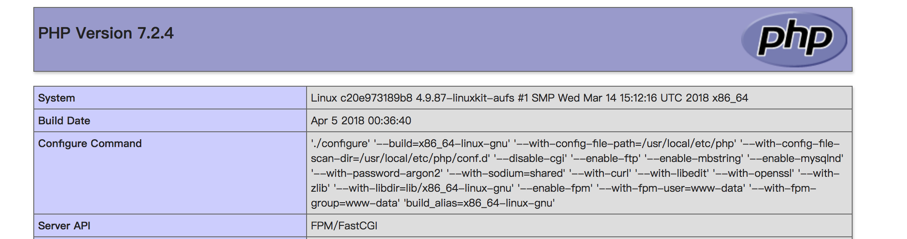

# Docker 快速搭建 LNMP 开发环境 

只要你敢尝试一次，就再也不会拒绝它

## 如何使用？

#### 1. 安装工具

- Git
- Docker [https://docs.docker.com/install/]
- Docker-compose [https://docs.docker.com/compose/install/#install-compose]

#### 2. 下载代码

```
$ git clone https://github.com/helingfeng/dnmp.git
```
    
#### 4. 启动服务

```
$ cd dnmp
$ docker-compose up
```

第一次启用服务，需要下载并编译各种工具，请耐心等待一段时间

#### 5. 访问 Demo

打开浏览器访问:
- http://127.0.0.1/
- https://127.0.0.1/

看到`PHP`版本信息输出



done.
