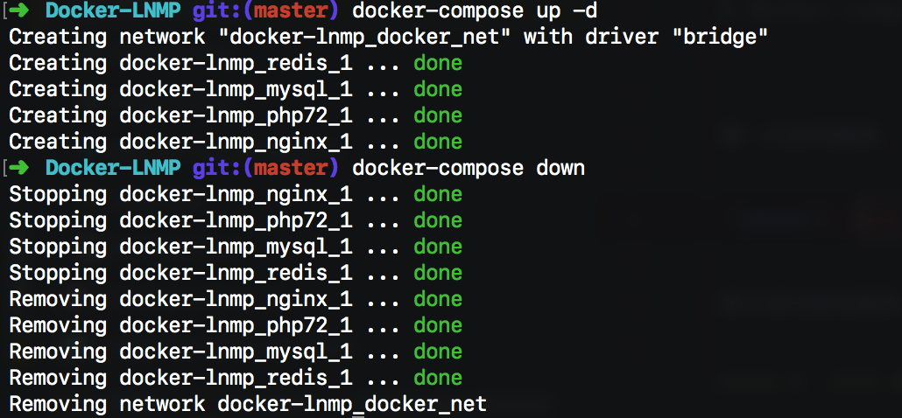

# Docker 快速搭建 Lnmp 开发环境 

只要你敢尝试一次，就再也不会拒绝它

## 如何使用？

#### 1. 安装工具

- Git
- Docker [https://docs.docker.com/install/]
- Docker-compose [https://docs.docker.com/compose/install/#install-compose]

#### 2. 下载代码

```
$ git clone https://github.com/helingfeng/Docker-LNMP.git
```
    
#### 4. 启动服务

```
$ cd Docker-LNMP
$ docker-compose up -d
```

第一次启用服务，需要下载并编译各种工具，请耐心等待一段时间



表示成功启动服务

#### 5. 访问 Demo

打开浏览器访问:
- http://127.0.0.1/ （强制跳转 https）
- https://127.0.0.1/  （由于证书不安全，所以需要点击继续访问）


## 更多使用说明

[查看文档](wiki.md)