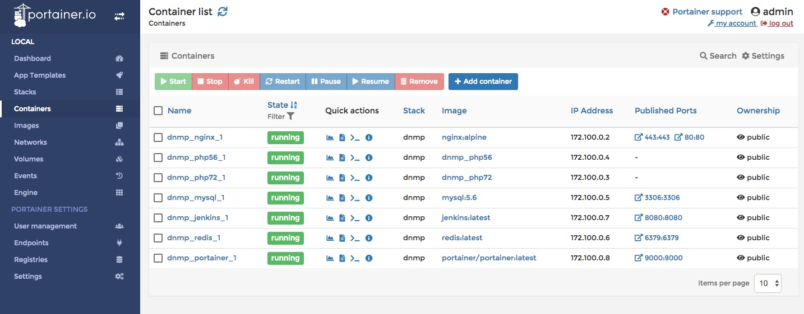

### 第一步，安装依赖工具

- Git  // brew install git
- Docker [https://docs.docker.com/install/]
- Docker-compose [https://docs.docker.com/compose/install/#install-compose]

### 第二步，获取项目代码

```
$ git clone https://github.com/helingfeng/Docker-LNMP.git
```
    
### 第三步，运行容器编排

```
$ cd Docker-LNMP   // 进入项目根目录
$ docker-compose up -d   // 容器编排命令
```

启用服务，第一次需要构建镜像


### 第四步，测试服务访问

http://127.0.0.1/ （可配置强制跳转 https）

https://127.0.0.1/  （由于证书不安全，所以需要点击继续访问）

http://127.0.0.1:9000 （访问 Docker GUI 管理工具）
